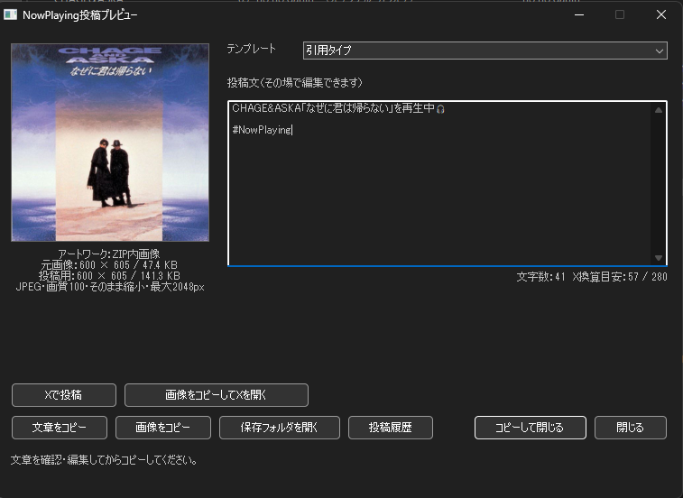
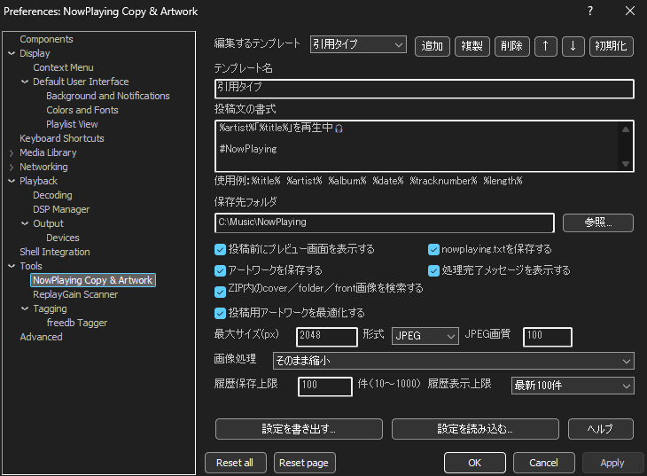
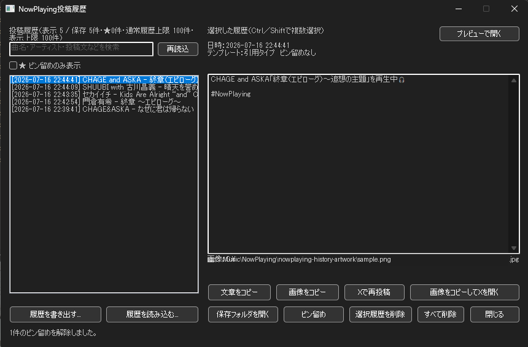
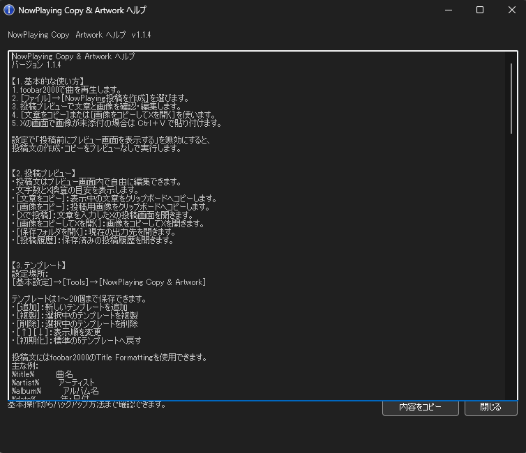

# NowPlaying Copy & Artwork

foobar2000で再生中の曲情報とアートワークから、  
Xなどへ投稿するための文章と画像を作成するWindows向けコンポーネントです。

投稿テンプレート、アートワーク検索・最適化、投稿履歴、ピン留め、  
設定・履歴のバックアップ、日本語ヘルプなどに対応しています。

> [!NOTE]
> 本コンポーネントは、foobar2000公式ではない第三者製コンポーネントです。

## Download

最新版は、GitHubの **[Releases](../../releases/latest)** からダウンロードしてください。

通常の利用者は、次の形式のファイルをダウンロードしてください。

```text
foo_nowplaying_copy_vX.X.X.fb2k-component
```

## Features

### 投稿文の作成

- 再生中の曲情報から投稿文を作成
- 1～20個の投稿テンプレートを保存
- テンプレートの追加、複製、削除、並べ替え
- 複数行テンプレート対応
- foobar2000のTitle Formatting構文に対応
- 投稿前プレビュー
- 投稿文の編集
- 文字数とX換算文字数の目安を表示
- 投稿文をクリップボードへコピー
- 投稿文を `nowplaying.txt` へ保存

### アートワーク

次の順でアートワークを検索します。

1. 音源へ埋め込まれたフロントカバー
2. 音源と同じフォルダーにある画像
   - `cover`
   - `folder`
   - `front`
3. ZIP内にある画像
   - `cover`
   - `folder`
   - `front`

投稿用画像の最適化にも対応しています。

- JPEG／PNG変換
- 最大サイズ指定
- JPEG画質指定
- 縦横比を維持したリサイズ
- 中央を正方形に切り抜き
- 投稿用画像をクリップボードへコピー

### Xへの投稿補助

- 投稿文を入力したXの投稿画面を開く
- 投稿用画像をクリップボードへコピーしてXを開く
- 投稿実行時に履歴を自動保存

> [!IMPORTANT]
> Webブラウザーの制限により、画像をXへ直接自動添付することはできません。  
> ［画像をコピーしてXを開く］を実行したあと、Xの投稿画面で `Ctrl + V` を押してください。

### 投稿履歴

- 投稿日時、曲名、アーティスト、テンプレート、投稿文、画像を保存
- 履歴の検索
- 履歴から投稿文を再編集
- 履歴からXの投稿画面を再度開く
- 履歴画像をコピー
- Ctrl／Shiftを使った複数選択
- 複数履歴の投稿文をまとめてコピー
- 複数履歴の一括削除
- 履歴のピン留め
- ピン留め履歴のみ表示
- ピン留め履歴を自動整理の対象外にする
- 履歴保存上限を設定
- 履歴表示上限を設定

### バックアップ

- 設定をINIファイルへ書き出し
- 設定をINIファイルから読み込み
- 投稿履歴と履歴画像をZIPへ書き出し
- 履歴ZIPを追加または置き換えで復元
- ピン留め情報もバックアップ
- 重複履歴の登録防止

### その他

- 日本語ヘルプ画面
- ヘルプ全文のコピー
- ダークモード対応
- 出力フォルダーを開く機能

## Requirements

- Windows
- foobar2000 64-bit版
- foobar2000 v2.x

動作確認環境：

```text
foobar2000 v2.26 preview x64
Windows 64-bit
```

現在、foobar2000 32-bit版には対応していません。

## Installation

1. [Releases](../../releases/latest)から最新版の `.fb2k-component` をダウンロードします。
2. foobar2000を起動します。
3. ［ファイル］→［基本設定］→［Components］を開きます。
4. ［Install...］を押します。
5. ダウンロードした `.fb2k-component` を選択します。
6. ［Apply］または［OK］を押します。
7. foobar2000を再起動します。

## Basic Usage

1. foobar2000で曲を再生します。
2. ［ファイル］→［NowPlaying投稿を作成］を選びます。
3. 投稿プレビューで文章と画像を確認します。
4. 必要に応じて投稿文を編集します。
5. ［文章をコピー］または［画像をコピーしてXを開く］を使用します。
6. Xへ画像を付ける場合は、投稿画面で `Ctrl + V` を押します。

投稿履歴は、次の場所から開けます。

```text
［ファイル］→［NowPlaying投稿履歴］
```

ヘルプは、次のどちらからでも開けます。

```text
［ファイル］→［NowPlayingヘルプ］
```

```text
［基本設定］→［Tools］→［NowPlaying Copy & Artwork］→［ヘルプ］
```

## Templates

テンプレートには、foobar2000のTitle Formattingを使用できます。

主な例：

| 変数 | 内容 |
|---|---|
| `%title%` | 曲名 |
| `%artist%` | アーティスト |
| `%album%` | アルバム名 |
| `%date%` | 年・日付 |
| `%tracknumber%` | トラック番号 |
| `%length%` | 再生時間 |

例：

```text
#NowPlaying
%title%
%artist%
%album%
```

条件分岐など、通常のTitle Formatting構文も使用できます。

## Generated Files

設定した出力フォルダーには、主に次のファイルが作成されます。

| ファイル／フォルダー | 内容 |
|---|---|
| `nowplaying.txt` | 現在の投稿文 |
| `artwork-post.jpg` | 最適化されたJPEG画像 |
| `artwork-post.png` | 最適化されたPNG画像 |
| `nowplaying-history.tsv` | 投稿履歴の管理データ |
| `nowplaying-history-artwork` | 履歴画像の保存フォルダー |

`nowplaying-history.tsv` を直接編集して上書きすると、履歴を読み込めなくなる可能性があります。

## Known Limitations

- Xへ画像を直接自動添付することはできません。
- Xへの画像投稿時は、投稿画面で `Ctrl + V` を押す必要があります。
- 現在はfoobar2000 64-bit版のみ対応しています。
- X側の仕様変更により、投稿画面の動作が変わる可能性があります。
- 画像が見つからない場合でも、投稿文のみ作成できます。

## Screenshots

スクリーンショットを追加する場合は、リポジトリに `images` フォルダーを作成し、次のように掲載できます。

```markdown




```

## Build

### 必要な環境

- Visual Studio 2022
- Desktop development with C++
- foobar2000 SDK
- Windows 64-bit開発環境

### ビルド手順

1. foobar2000 SDKを用意します。
2. `foo_nowplaying_copy` フォルダーをSDKのプロジェクト配置先へ置きます。
3. `foo_nowplaying_copy.sln` をVisual Studioで開きます。
4. 構成を `Release` にします。
5. プラットフォームを `x64` にします。
6. ［ビルド］→［ソリューションのリビルド］を実行します。

生成されたDLLは、配布時に次の構成で `.fb2k-component` へ収録します。

```text
license.txt
x64/
└─ foo_nowplaying_copy.dll
```

> [!IMPORTANT]
> foobar2000 SDK本体は、このリポジトリへ含めないでください。

## Bug Reports

不具合報告はGitHub Issuesからお願いします。

報告時には、可能な範囲で次の情報を記載してください。

- foobar2000のバージョン
- Windowsのバージョン
- コンポーネントのバージョン
- 問題が発生するまでの操作手順
- 表示されたエラー内容
- スクリーンショット
- 使用した音源形式
- アートワークの保存形式や配置場所

個人情報、音源ファイル、投稿履歴などを誤って添付しないようご注意ください。

## License

This project is licensed under the MIT License.

```text
Copyright (c) 2026 Maximum
```

詳細は [LICENSE](LICENSE) を確認してください。
