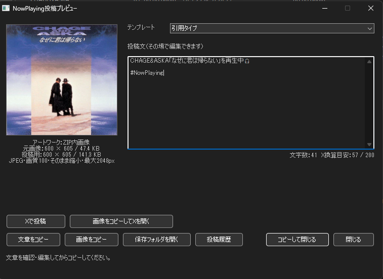
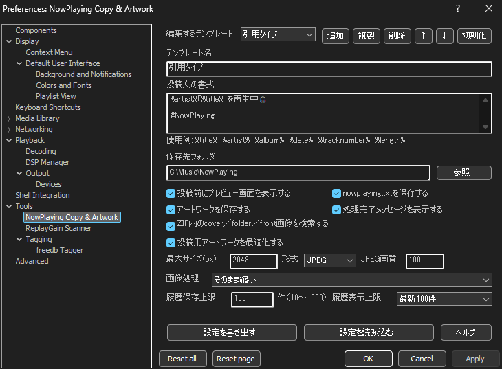
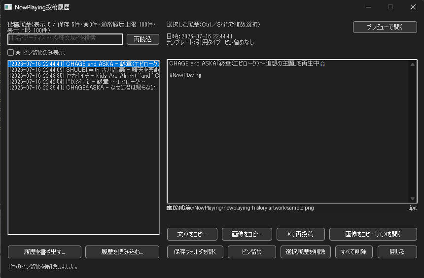
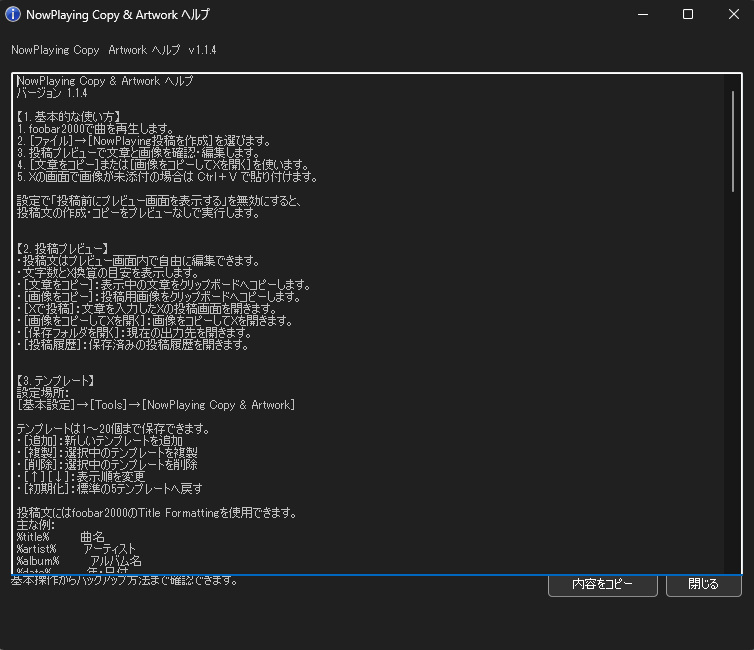

# NowPlaying Copy & Artwork

[English](#english) | [日本語](#日本語)

---

# English

A Windows foobar2000 component that creates NowPlaying post text and artwork from the currently playing track.

It supports posting assistance for X, customizable templates, artwork search and optimization, post history, pinning, settings/history backup, and Japanese/English UI.

> [!NOTE]
> This is an unofficial third-party component for foobar2000.

## Download

Download the latest version from **[Releases](../../releases/latest)**.

For normal use, download:

```text
foo_nowplaying_copy_vX.X.X.fb2k-component
```

## Features

### Post text

- Create post text from the currently playing track
- Store 1–20 templates
- Add, duplicate, delete, and reorder templates
- Support multiline templates
- Support foobar2000 Title Formatting
- Preview before posting
- Edit post text in the preview window
- Show character count and an approximate X-weight count
- Copy post text to the clipboard
- Save post text as `nowplaying.txt`

### Artwork

Artwork is searched approximately in this order:

1. Embedded front cover
2. `cover`, `folder`, or `front` image in the track folder
3. `cover`, `folder`, or `front` image inside ZIP files

Artwork optimization supports:

- JPEG / PNG conversion
- Maximum image size
- JPEG quality
- Keep aspect ratio
- Center square crop
- Copy posting artwork to the clipboard

### X posting assistance

- Open the X compose page with post text
- Copy artwork and open X
- Save post history when opening X

> [!IMPORTANT]
> Due to web-browser restrictions, artwork cannot be attached to X automatically.  
> After using **Copy Image and Open X**, press `Ctrl + V` in the X compose page.

### Post history

- Save date/time, title, artist, template, post text, and artwork
- Search post history
- Reopen history entries in Preview
- Copy history text or artwork
- Repost on X
- Ctrl/Shift multiple selection
- Copy multiple post texts together
- Delete multiple entries
- Pin important entries
- Show pinned entries only
- Protect pinned entries from automatic trimming
- Configure history save limit
- Configure history display limit

### Backup

- Export settings to an INI file
- Import settings from an INI file
- Export post history and artwork to a ZIP file
- Restore history by adding to or replacing current history
- Preserve pin information
- Avoid duplicate history entries during restore

### Language

The UI language can be set to:

- Automatic
- 日本語
- English

**Automatic** uses Japanese on a Japanese Windows UI and English otherwise.

Existing custom template names and contents are preserved when switching languages.

### Other

- Built-in Japanese/English help
- Copy help text to the clipboard
- Dark mode support
- Open output folder

## Requirements

- Windows
- foobar2000 64-bit
- foobar2000 v2.x

Tested with:

```text
foobar2000 v2.26 preview x64
Windows 64-bit
```

32-bit foobar2000 is currently not supported.

## Installation

1. Download the latest `.fb2k-component` from [Releases](../../releases/latest).
2. Open foobar2000.
3. Open **File > Preferences > Components**.
4. Click **Install...**.
5. Select the downloaded `.fb2k-component`.
6. Click **Apply** or **OK**.
7. Restart foobar2000.

## Basic Usage

1. Play a track in foobar2000.
2. Choose **File > Create NowPlaying Post**.
3. Review the text and artwork in the preview.
4. Edit the text if necessary.
5. Use **Copy Text** or **Copy Image and Open X**.
6. To attach artwork on X, press `Ctrl + V` in the compose page.

Post history:

```text
File > NowPlaying Post History
```

Help:

```text
File > NowPlaying Help
```

or:

```text
Preferences > Tools > NowPlaying Copy & Artwork > Help
```

## Templates

Templates use foobar2000 Title Formatting.

| Variable | Meaning |
|---|---|
| `%title%` | Track title |
| `%artist%` | Artist |
| `%album%` | Album |
| `%date%` | Date / year |
| `%tracknumber%` | Track number |
| `%length%` | Duration |

Example:

```text
#NowPlaying
%title%
%artist%
%album%
```

Normal Title Formatting conditions and multiline formats are supported.

## Screenshots

### Post Preview



### Preferences



### Post History



### Help



## Generated Files

| File / Folder | Description |
|---|---|
| `nowplaying.txt` | Current post text |
| `artwork-post.jpg` | Optimized JPEG artwork |
| `artwork-post.png` | Optimized PNG artwork |
| `nowplaying-history.tsv` | Post-history data |
| `nowplaying-history-artwork` | Saved history artwork |

Avoid directly editing and overwriting `nowplaying-history.tsv`.

## Known Limitations

- Artwork cannot be attached to X automatically.
- Press `Ctrl + V` in the X compose page to paste copied artwork.
- Only 64-bit foobar2000 is currently supported.
- X-side behavior may change if X changes its web interface.
- Post text can still be created when no artwork is found.

## Build

### Requirements

- Visual Studio 2022
- Desktop development with C++
- foobar2000 SDK
- Windows 64-bit development environment

### Build steps

1. Prepare the foobar2000 SDK.
2. Place the `foo_nowplaying_copy` folder in the SDK project location.
3. Open `foo_nowplaying_copy.sln` in Visual Studio.
4. Select `Release`.
5. Select `x64`.
6. Run **Build > Rebuild Solution**.

The distributed `.fb2k-component` contains:

```text
license.txt
x64/
└─ foo_nowplaying_copy.dll
```

> [!IMPORTANT]
> Do not include the foobar2000 SDK itself in this repository.

## Bug Reports

Please use GitHub Issues for bug reports.

When possible, include:

- foobar2000 version
- Windows version
- Component version
- Steps to reproduce
- Error message
- Screenshot
- Audio format
- Artwork location / format

Do not attach personal information, copyrighted audio files, or private post history.

## License

MIT License

```text
Copyright (c) 2026 Maximum
```

See [LICENSE](LICENSE) for details.

---

# 日本語

foobar2000で再生中の曲情報とアートワークから、  
Xなどへ投稿するための文章と画像を作成するWindows向けコンポーネントです。

投稿テンプレート、アートワーク検索・最適化、投稿履歴、ピン留め、  
設定・履歴のバックアップ、日本語／英語UIなどに対応しています。

> [!NOTE]
> 本コンポーネントは、foobar2000公式ではない第三者製コンポーネントです。

## ダウンロード

最新版は **[Releases](../../releases/latest)** からダウンロードしてください。

通常の利用者は、次の形式のファイルをダウンロードしてください。

```text
foo_nowplaying_copy_vX.X.X.fb2k-component
```

## 主な機能

### 投稿文

- 再生中の曲情報から投稿文を作成
- 1～20個の投稿テンプレートを保存
- テンプレートの追加、複製、削除、並べ替え
- 複数行テンプレート対応
- foobar2000のTitle Formatting構文に対応
- 投稿前プレビュー
- 投稿文の編集
- 文字数とX換算文字数の目安を表示
- 投稿文をクリップボードへコピー
- 投稿文を `nowplaying.txt` へ保存

### アートワーク

おおむね次の順でアートワークを検索します。

1. 音源へ埋め込まれたフロントカバー
2. 音源と同じフォルダーの `cover` / `folder` / `front`
3. ZIP内の `cover` / `folder` / `front`

投稿用画像の最適化にも対応しています。

- JPEG／PNG変換
- 最大画像サイズ指定
- JPEG画質指定
- 縦横比を維持したリサイズ
- 中央を正方形に切り抜き
- 投稿用画像をクリップボードへコピー

### Xへの投稿補助

- 投稿文を入力したXの投稿画面を開く
- 投稿用画像をコピーしてXを開く
- Xを開いた際に投稿履歴を保存

> [!IMPORTANT]
> Webブラウザーの制限により、画像をXへ直接自動添付することはできません。  
> ［画像をコピーしてXを開く］の後、Xの投稿画面で `Ctrl + V` を押してください。

### 投稿履歴

- 投稿日時、曲名、アーティスト、テンプレート、投稿文、画像を保存
- 履歴検索
- 履歴から投稿プレビューを再表示
- 投稿文／画像のコピー
- Xで再投稿
- Ctrl／Shiftによる複数選択
- 複数履歴の投稿文をまとめてコピー
- 複数履歴の一括削除
- ピン留め
- ピン留めのみ表示
- ピン留め履歴を自動整理から保護
- 履歴保存上限
- 履歴表示上限

### バックアップ

- 設定をINIファイルへ書き出し
- 設定をINIファイルから読み込み
- 投稿履歴と履歴画像をZIPへ書き出し
- 履歴ZIPを追加／置き換えで復元
- ピン留め情報を保存
- 復元時の重複登録を防止

### 表示言語

表示言語は次から選択できます。

- 自動
- 日本語
- English

「自動」では、日本語UIのWindowsでは日本語、それ以外では英語を使用します。

既存の自作テンプレート名や内容は、言語切り替え時に変更されません。

### その他

- 日本語／英語ヘルプ
- ヘルプ全文のコピー
- ダークモード対応
- 出力フォルダーを開く機能

## 対応環境

- Windows
- foobar2000 64-bit版
- foobar2000 v2.x

動作確認環境：

```text
foobar2000 v2.26 preview x64
Windows 64-bit
```

現在、foobar2000 32-bit版には対応していません。

## インストール

1. [Releases](../../releases/latest)から最新版の `.fb2k-component` をダウンロードします。
2. foobar2000を起動します。
3. ［ファイル］→［基本設定］→［Components］を開きます。
4. ［Install...］を押します。
5. ダウンロードした `.fb2k-component` を選択します。
6. ［Apply］または［OK］を押します。
7. foobar2000を再起動します。

## 基本的な使い方

1. foobar2000で曲を再生します。
2. ［ファイル］→［NowPlaying投稿を作成］を選びます。
3. 投稿プレビューで文章と画像を確認します。
4. 必要に応じて投稿文を編集します。
5. ［文章をコピー］または［画像をコピーしてXを開く］を使用します。
6. Xへ画像を付ける場合は、投稿画面で `Ctrl + V` を押します。

投稿履歴：

```text
［ファイル］→［NowPlaying投稿履歴］
```

ヘルプ：

```text
［ファイル］→［NowPlayingヘルプ］
```

または：

```text
［基本設定］→［Tools］→［NowPlaying Copy & Artwork］→［ヘルプ］
```

## テンプレート

テンプレートには、foobar2000のTitle Formattingを使用できます。

| 変数 | 内容 |
|---|---|
| `%title%` | 曲名 |
| `%artist%` | アーティスト |
| `%album%` | アルバム名 |
| `%date%` | 年・日付 |
| `%tracknumber%` | トラック番号 |
| `%length%` | 再生時間 |

例：

```text
#NowPlaying
%title%
%artist%
%album%
```

条件分岐など、通常のTitle Formatting構文も使用できます。

## スクリーンショット

### 投稿プレビュー


### 設定画面


### 投稿履歴


### ヘルプ画面


## 作成される主なファイル

| ファイル／フォルダー | 内容 |
|---|---|
| `nowplaying.txt` | 現在の投稿文 |
| `artwork-post.jpg` | 最適化されたJPEG画像 |
| `artwork-post.png` | 最適化されたPNG画像 |
| `nowplaying-history.tsv` | 投稿履歴の管理データ |
| `nowplaying-history-artwork` | 履歴画像の保存フォルダー |

`nowplaying-history.tsv` を直接編集して上書きすると、履歴を読み込めなくなる可能性があります。

## 既知の制限

- Xへ画像を直接自動添付することはできません。
- Xへの画像投稿時は、投稿画面で `Ctrl + V` を押す必要があります。
- 現在はfoobar2000 64-bit版のみ対応しています。
- X側の仕様変更により、投稿画面の動作が変わる可能性があります。
- 画像が見つからない場合でも、投稿文のみ作成できます。

## ビルド

### 必要な環境

- Visual Studio 2022
- Desktop development with C++
- foobar2000 SDK
- Windows 64-bit開発環境

### ビルド手順

1. foobar2000 SDKを用意します。
2. `foo_nowplaying_copy` フォルダーをSDKのプロジェクト配置先へ置きます。
3. `foo_nowplaying_copy.sln` をVisual Studioで開きます。
4. 構成を `Release` にします。
5. プラットフォームを `x64` にします。
6. ［ビルド］→［ソリューションのリビルド］を実行します。

配布用 `.fb2k-component` は次の構成です。

```text
license.txt
x64/
└─ foo_nowplaying_copy.dll
```

> [!IMPORTANT]
> foobar2000 SDK本体は、このリポジトリへ含めないでください。

## 不具合報告

不具合報告はGitHub Issuesからお願いします。

可能な範囲で次の情報を記載してください。

- foobar2000のバージョン
- Windowsのバージョン
- コンポーネントのバージョン
- 再現手順
- エラー内容
- スクリーンショット
- 使用した音源形式
- アートワークの保存形式や配置場所

個人情報、音源ファイル、投稿履歴などを誤って添付しないようご注意ください。

## ライセンス

MIT License

```text
Copyright (c) 2026 Maximum
```

詳細は [LICENSE](LICENSE) を確認してください。
